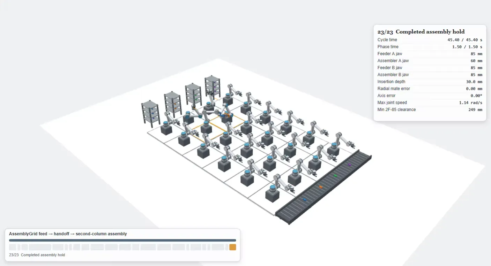
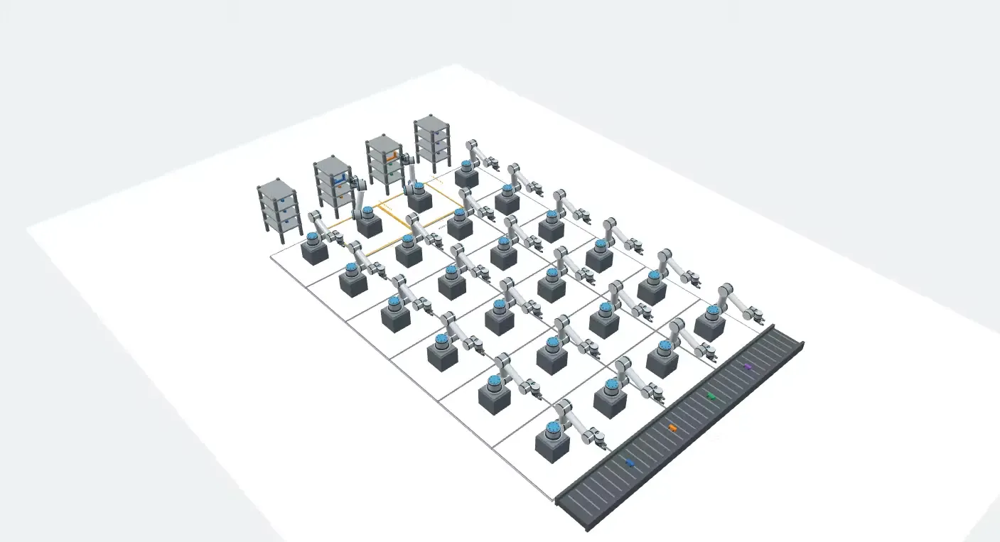

# AssemblyGrid v1

<p align="center">
  
</p>

<p align="center">
  
</p>

AssemblyGrid is a benchmark for multi-robot production with recipe-driven material flow, temporary robot coalitions, local observations, and task-level geometric constraints.

The official suite contains nine scenarios: Flow, Coalition and Concurrency, each with easy, medium and hard configurations. The geometry profile is `abstract-v1`. Task success and benchmark metrics are independent of the controller's training reward.

## Install

Use Python 3.11 in a virtual environment:

```sh
python -m venv .venv
```

Activate it with `.venv\Scripts\activate` on Windows or `source .venv/bin/activate` on Linux/macOS, then install:

```sh
python -m pip install -r requirements-v1-lock.txt
```

## Run

From the repository root:

```sh
python examples/quickstart_core.py
python examples/quickstart_official.py
python examples/quickstart_algorithm_support.py
python tools/verify_instances.py
python -m pytest Experiments/env/tests -q
```

## Use the benchmark

`Experiments/env/standards.py` provides `official_instance_suite(index)`. Each index produces the nine official scenario configurations. `official/official_realizations.json` contains 45 verified realizations across indices 0–4; the loader in `Experiments/env/official.py` checks their content identity.

Use `AssemblyGridCore` for direct simulation or `AssemblyGridParallelEnv` in `pettingzoo_env.py` for the PettingZoo parallel interface. Each agent selects an action using its observation and action mask. Read production and coordination metrics from `env.core.metrics()`. Privileged state access must be declared separately from local execution observations.

## Contents

- `Experiments/env/`: simulator, interfaces, IPPO/MAPPO/QMIX controllers and tests.
- `Experiments/configs/`: runnable configurations.
- `Experiments/recipes/`: recipe definitions.
- `official/`: official realization catalogue, plus the historical geometry catalogue
  (`historical_realizations.json`), excluded from every official aggregate.
- `schemas/`: recipe and result schemas.
- `examples/`: runnable examples.
- `reference_training/`: the IPPO/MAPPO/QMIX training code of the reported 270-run
  campaign, including the `StructuredActor` policy network and the campaign runners.
  `Experiments/env/marl/` holds the smaller interface-demonstration implementations.
- `tools/verify_instances.py`: verification of all official catalogue entries.
- `Experiments/env/audits.py`: release audits for action-space addressability and
  coalition-formation sanity (`python Experiments/env/audits.py`).

## Citation

If you use AssemblyGrid v1 in your research, experiments, or derived work, please cite the accompanying paper:

> Fouad Bahrpeyma, David Heik, and Dirk Reichelt.  
> **AssemblyGrid v1: A Benchmark for Multi-Robot Production with Temporary Coalitions, Local Information, and Geometric Constraints.**  
> arXiv preprint arXiv:2609.16075, 2026.  
> [AssemblyGrid v1: A Benchmark for Multi-Robot Production with Temporary Coalitions, Local Information, and Geometric Constraints](https://doi.org/10.48550/arXiv.2609.16075)

### BibTeX

```bibtex
@article{bahrpeyma2026assemblygrid,
  title   = {AssemblyGrid v1: A Benchmark for Multi-Robot Production with Temporary Coalitions, Local Information, and Geometric Constraints},
  author  = {Bahrpeyma, Fouad and Heik, David and Reichelt, Dirk},
  journal = {arXiv preprint arXiv:2609.16075},
  year    = {2026},
  doi     = {10.48550/arXiv.2609.16075},
  url     = {https://arxiv.org/abs/2609.16075}
}
```

We appreciate citations to the paper when AssemblyGrid v1 is used as a benchmark, experimental environment, or basis for further development.

Citation metadata for this GitHub repository and its associated software release is provided in `CITATION.cff`.

## License

Released under the MIT License, Copyright (c) 2026 Fouad Bahrpeyma. See `LICENSE`.

The release history is recorded in `CHANGELOG.md`.

