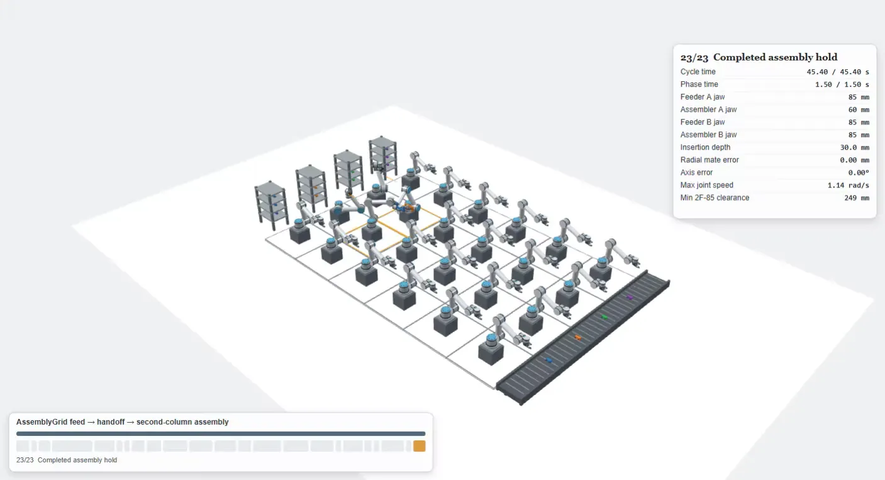
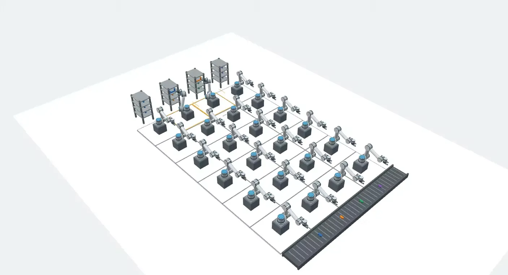
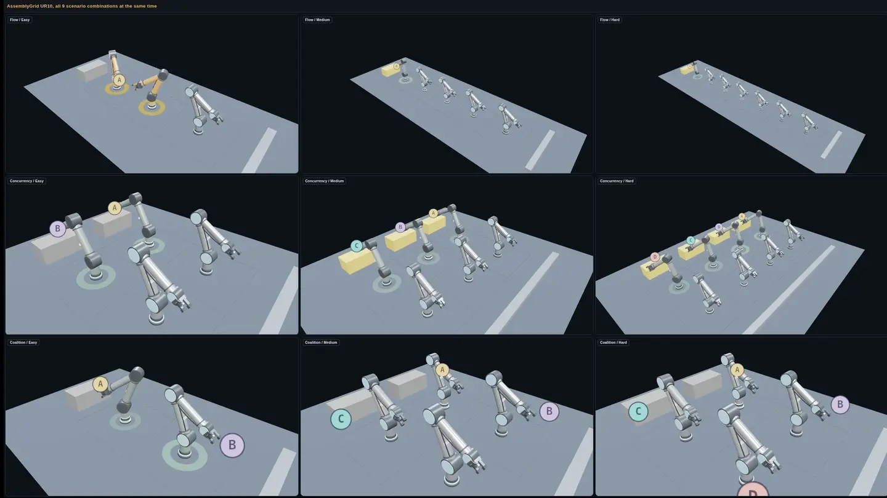
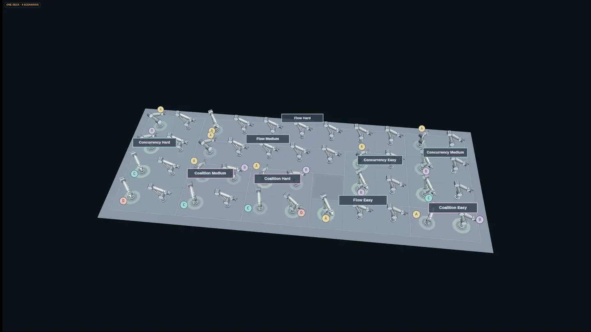

# AssemblyGrid v1

**AssemblyGrid v1** is a benchmark for decentralized multi-robot production with recipe-driven material flow, temporary robot coalitions, local observations, productive concurrency, material handoffs, and task-level geometric constraints.

The official benchmark suite contains nine scenarios across three scenario families, **Flow, Coalition, and Concurrency**, each provided at **easy, medium, and hard** difficulty levels. The official geometry profile is `abstract-v1`.

Task success and benchmark metrics are defined independently of the controller's training reward, allowing different learning, optimization, heuristic, and rule-based control approaches to be evaluated within the same benchmark formulation.

## Resources

- **Paper:** [AssemblyGrid v1: A Benchmark for Multi-Robot Production with Temporary Coalitions, Local Information, and Geometric Constraints](https://arxiv.org/abs/2609.16075)
- **Benchmark code and reproducibility archive:** [Zenodo](https://doi.org/10.5281/zenodo.22734115)
- **Interactive visualization of all 9 official scenarios:** [Hugging Face Space](https://huggingface.co/spaces/Fouad-Bahrpeyma/AssemblyGrid-v1)
- **Interactive AssemblyGrid v1 project demo:** [assemblygridv1.vercel.app](https://assemblygridv1.vercel.app/)

## Benchmark overview

<p align="center">
  
</p>
<p align="left"><sub>AssemblyGrid v1, copyright (c) 2026 Fouad Bahrpeyma</sub></p>

AssemblyGrid v1 represents production as a decentralized multi-robot system in which agents act from local information while collectively executing recipe-defined production processes.

The benchmark includes:

- recipe-driven material and process progression,
- decentralized decision-making from local observations,
- robot-to-robot material handoffs,
- temporary recipe-defined robot coalitions,
- simultaneous productive activities,
- multiple products and production processes,
- task-level geometric feasibility constraints,
- explicit benchmark metrics for production and coordination performance.

<p align="center">
  
</p>
<p align="left"><sub>AssemblyGrid v1, copyright (c) 2026 Fouad Bahrpeyma</sub></p>

## Official scenario suite

The official suite contains three scenario families:

### Flow

Flow scenarios emphasize recipe-driven product progression and material movement through the production system.

### Coalition

Coalition scenarios include operations that require temporary groups of robots to execute a recipe-defined operation together.

### Concurrency

Concurrency scenarios emphasize simultaneous productive activities and the ability of the production system to execute independent operations in parallel.

Each scenario family is provided at three difficulty levels:

- **Easy**
- **Medium**
- **Hard**

Together, the three families and three difficulty levels define the **nine official AssemblyGrid v1 scenarios**.

<p align="center">
  
</p>
<p align="left"><sub>AssemblyGrid v1, copyright (c) 2026 Fouad Bahrpeyma</sub></p>

The same nine scenarios can also be visualized within a shared presentation environment:

<p align="center">
  
</p>
<p align="left"><sub>AssemblyGrid v1, copyright (c) 2026 Fouad Bahrpeyma</sub></p>

## Installation

AssemblyGrid v1 uses Python 3.11.

Create a virtual environment:

```sh
python -m venv .venv
```

Activate the environment on Windows:

```sh
.venv\Scripts\activate
```

or on Linux/macOS:

```sh
source .venv/bin/activate
```

Install the locked dependencies:

```sh
python -m pip install -r requirements-v1-lock.txt
```

## Quick start

Run the following commands from the repository root:

```sh
python examples/quickstart_core.py
python examples/quickstart_official.py
python examples/quickstart_algorithm_support.py
python tools/verify_instances.py
python -m pytest Experiments/env/tests -q
```

The examples cover direct simulator use, loading the official scenario suite, algorithm-support interfaces, catalogue verification, and release tests.

## Using the benchmark

`Experiments/env/standards.py` provides:

```python
official_instance_suite(index)
```

Each index produces the nine official scenario configurations.

The file:

```text
official/official_realizations.json
```

contains **45 verified realizations across indices 0–4**. The loader in `Experiments/env/official.py` checks their content identity.

Two primary interfaces are available:

- **`AssemblyGridCore`** for direct simulation.
- **`AssemblyGridParallelEnv`** in `pettingzoo_env.py` for the PettingZoo parallel multi-agent interface.

Each agent selects an action using its local observation and corresponding action mask.

Production and coordination metrics are available through:

```python
env.core.metrics()
```

Privileged state access, when used by an algorithm, must be declared separately from the local observations available during decentralized execution.

## Official realizations

The authoritative official realization catalogue is:

```text
official/official_realizations.json
```

It contains verified realizations for the official benchmark suite.

The repository also contains:

```text
official/historical_realizations.json
```

which preserves the historical geometry catalogue. Historical realizations are excluded from all official benchmark aggregates.

## Algorithm support

The repository includes support for representative multi-agent reinforcement learning approaches, including:

- IPPO,
- MAPPO,
- QMIX.

The directory:

```text
reference_training/
```

contains the IPPO, MAPPO, and QMIX training code used for the reported **270-run experimental campaign**, including the `StructuredActor` policy network and campaign runners.

The smaller implementations in:

```text
Experiments/env/marl/
```

are intended primarily as interface demonstrations.

AssemblyGrid v1 is not restricted to MARL. The benchmark can also be used with heuristic, optimization-based, rule-based, search-based, or other control approaches, provided that the benchmark execution rules and observation assumptions are respected.

## Repository structure

```text
AssemblyGrid_v1/
├── Experiments/
│   ├── configs/              Runnable experiment configurations
│   ├── env/                  Simulator, interfaces, MARL controllers, tests, and audits
│   └── recipes/              Production recipe definitions
├── examples/                 Runnable benchmark examples
├── official/                 Official and historical realization catalogues
├── reference_training/       Training code for the reported experimental campaign
├── schemas/                  Recipe and result schemas
├── tools/                    Verification and supporting utilities
├── docs/                     Documentation and media
├── requirements-v1-lock.txt  Locked Python dependencies
├── CITATION.cff              Citation metadata
├── CHANGELOG.md              Release history
└── LICENSE                   MIT License
```

Important components include:

- `Experiments/env/standards.py`: official benchmark suite construction.
- `Experiments/env/official.py`: official realization loading and identity checks.
- `Experiments/env/pettingzoo_env.py`: PettingZoo parallel environment.
- `Experiments/env/audits.py`: release audits for action-space addressability and coalition-formation sanity.
- `tools/verify_instances.py`: verification of all official catalogue entries.
- `reference_training/`: training implementation used for the reported IPPO, MAPPO, and QMIX campaign.

Run the release audits with:

```sh
python Experiments/env/audits.py
```

## Reproducibility

AssemblyGrid v1 separates the benchmark definition from individual controller implementations.

The release provides:

- an authoritative official scenario suite,
- verified realization catalogues,
- locked Python dependencies,
- executable examples,
- result and recipe schemas,
- release audits,
- automated tests,
- reference MARL implementations,
- the training code used for the reported experimental campaign.

The archived benchmark release and reproducibility materials are available through [Zenodo](https://doi.org/10.5281/zenodo.22734115).

## Citation

If you use AssemblyGrid v1 as a benchmark, experimental environment, software component, or basis for further development, please cite the accompanying paper:

> Fouad Bahrpeyma, David Heik, and Dirk Reichelt.  
> **AssemblyGrid v1: A Benchmark for Multi-Robot Production with Temporary Coalitions, Local Information, and Geometric Constraints.**  
> arXiv preprint arXiv:2609.16075, 2026.  
> [https://doi.org/10.48550/arXiv.2609.16075](https://doi.org/10.48550/arXiv.2609.16075)

### BibTeX

```bibtex
@article{bahrpeyma2026assemblygrid,
  title   = {AssemblyGrid v1: A Benchmark for Multi-Robot Production with Temporary Coalitions, Local Information, and Geometric Constraints},
  author  = {Bahrpeyma, Fouad and Heik, David and Reichelt, Dirk},
  journal = {arXiv preprint arXiv:2609.16075},
  year    = {2026},
  doi     = {10.48550/arXiv.2609.16075},
  url     = {https://arxiv.org/abs/2609.16075}
}
```

Citation metadata for the GitHub repository and associated software release is also provided in `CITATION.cff`.

## License

AssemblyGrid v1 is released under the MIT License.

Copyright (c) 2026 Fouad Bahrpeyma.

See [`LICENSE`](LICENSE) for the full license text.

Release history is recorded in [`CHANGELOG.md`](CHANGELOG.md).
